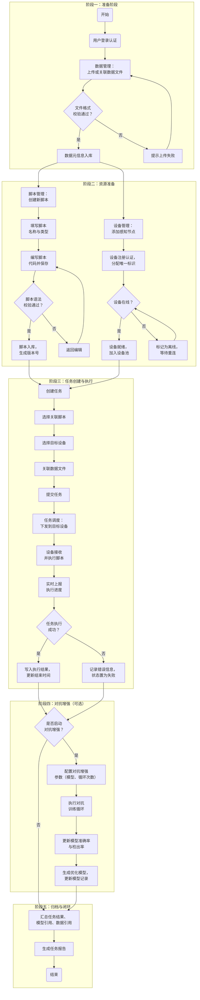

```mermaid
graph TD
    subgraph "阶段一：准备阶段"
        A(开始) --> B(用户登录认证)
        B --> C["数据管理：<br>上传或关联数据文件"]
        C --> D{"文件格式<br>校验通过？"}
        D -- 是 --> E[数据元信息入库]
        D -- 否 --> F[提示上传失败]
        F --> C
    end

    subgraph "阶段二：资源准备"
        E --> G["脚本管理：<br>创建新脚本"]
        E --> J["设备管理：<br>添加感知节点"]

        G --> H["填写脚本<br>名称与类型"]
        H --> I["编写脚本<br>代码并保存"]
        I --> K{"脚本语法<br>校验通过？"}
        K -- 是 --> L["脚本入库，<br>生成版本号"]
        K -- 否 --> M[返回编辑]
        M --> I

        J --> N["设备注册认证，<br>分配唯一标识"]
        N --> O{设备在线？}
        O -- 是 --> P["设备就绪，<br>加入设备池"]
        O -- 否 --> Q["标记为离线，<br>等待重连"]
        Q --> O
    end

    subgraph "阶段三：任务创建与执行"
        L --> R[创建任务]
        P --> R

        R --> S[选择关联脚本]
        S --> T[选择目标设备]
        T --> U[关联数据文件]
        U --> V[提交任务]
        V --> W["任务调度：<br>下发到目标设备"]
        W --> X["设备接收<br>并执行脚本"]
        X --> Y["实时上报<br>执行进度"]
        Y --> Z{"任务执行<br>成功？"}
        Z -- 是 --> AA["写入执行结果，<br>更新结束时间"]
        Z -- 否 --> BB["记录错误信息，<br>状态置为失败"]
    end

    subgraph "阶段四：对抗增强（可选）"
        AA --> CC{"是否启动<br>对抗增强？"}
        BB --> CC
        CC -- 是 --> DD["配置对抗增强<br>参数（模型、循环次数）"]
        DD --> EE["执行对抗<br>训练循环"]
        EE --> FF["更新模型准确率<br>与检出率"]
        FF --> GG["生成优化模型，<br>更新模型记录"]
    end

    subgraph "阶段五：归档与闭环"
        CC -- 否 --> HH["汇总任务结果、<br>模型引用、数据引用"]
        GG --> HH
        HH --> II[生成任务报告]
        II --> JJ(结束)
    end

```