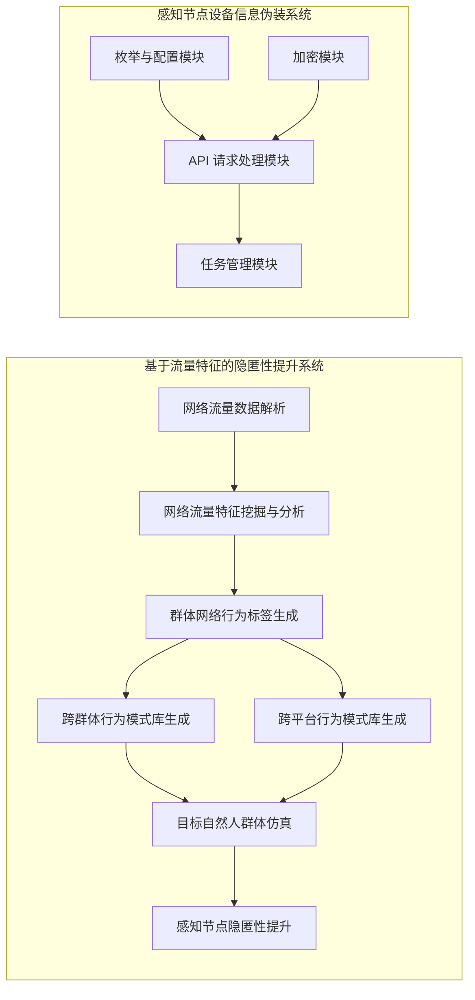

```mermaid
flowchart LR
  subgraph 子系统A [基于流量特征的隐匿性提升系统]
    A1[网络流量数据解析]
    A2[网络流量特征挖掘与分析]
    A3[群体网络行为标签生成]
    A4[跨群体行为模式库生成]
    A5[跨平台行为模式库生成]
    A6[目标自然人群体仿真]
    A7[感知节点隐匿性提升]
    A1 --> A2 --> A3 
    A3 --> A4
    A3 --> A5
    A4 --> A6 --> A7
    A5 --> A6
  end

  subgraph 子系统B [感知节点设备信息伪装系统]
    B4[枚举与配置模块]
    B1[加密模块]
    B2[API 请求处理模块]
    B3[任务管理模块]
    B4 --> B2
    B1 --> B2 --> B3
  end

```